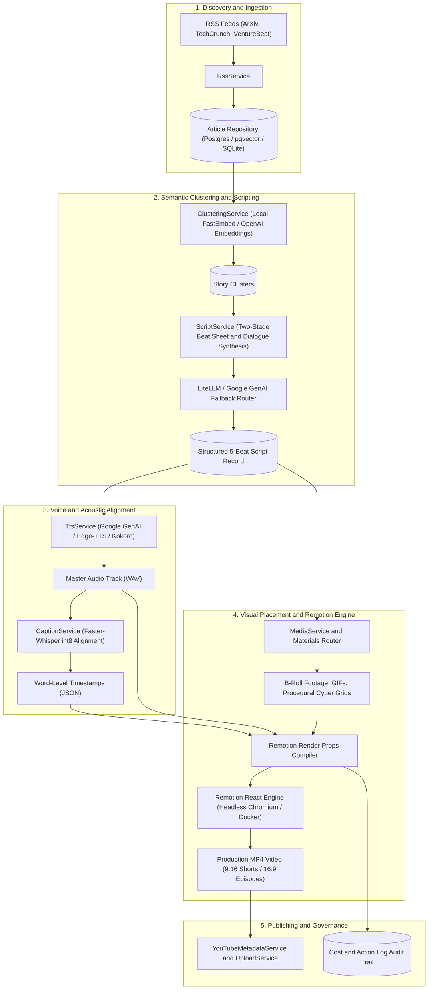

# AI News to YouTube Video Pipeline

[](https://github.com/eswar/ai-news-video-pipeline/actions/workflows/ci.yml)
[](https://github.com/astral-sh/ruff)
[](https://mypy-lang.org/)
[](https://www.python.org/)
[](https://opensource.org/licenses/MIT)
[](https://huggingface.co/spaces)

Automated, resilient AI news video studio that turns daily research papers and tech headlines into stylized, comedic video shorts and widescreen episodes using Remotion, LiteLLM, Prefect, and Faster-Whisper.

---

## High-Impact Project Pitch

The AI News Video Pipeline is an autonomous content engine designed to solve the bottleneck of daily tech video creation. Instead of requiring human editors, scriptwriters, and voiceover artists, this platform operates on an end-to-end automated loop:

1. Ingests raw RSS feeds from curated tech sources (ArXiv, TechCrunch, VentureBeat, GitHub Trending).
2. Performs vector-based semantic clustering with cosine similarity to identify breaking narratives.
3. Chains two-stage LLM prompts to synthesize structured 5-beat story sheets and comedic dialogue.
4. Generates expressive narration audio via Google GenAI Speech, Edge-TTS, or local Kokoro models.
5. Aligns spoken words to sub-frame millisecond timestamps using Faster-Whisper int8 models.
6. Selects relevant visual b-roll from stock repositories (Pexels, Giphy) or generates procedural canvas animations.
7. Renders production-ready MP4 videos in 9:16 (Shorts/TikTok) or 16:9 (YouTube Widescreen) using a containerized Remotion React engine.
8. Produces YouTube publishing packages complete with SEO titles, description chapters, and tags.

All operations run under sub-cent unit economics, strict cost guardrails, and automated circuit breakers.

---

## Architecture Flow Diagram



---

## Engineering Highlights and Architectural Trade-offs

### 1. Sub-Cent Cost Optimization with Local Embeddings and Gemini Flash
- Trade-off Analysis: Calling remote embedding APIs for hundreds of RSS feed items daily creates recurring operational overhead and latency bottlenecks.
- Technical Implementation: The pipeline implements local in-process embedding models using FastEmbed (`bge-small-en-v1.5`) running on CPU via ONNX Runtime. This eliminates network round-trips and drops clustering costs to zero dollars. For narrative generation, prompts are structured for Gemini 2.5 Flash and GPT-4o-mini, yielding total LLM generation spend of less than 0.005 USD per video.

### 2. Zero-Downtime Multi-Model Fallback Routing with LiteLLM and Google GenAI
- Trade-off Analysis: Hardcoding a single commercial LLM vendor creates vulnerability to API rate limits (HTTP 429), regional outages, and model deprecation.
- Technical Implementation: Model requests are mediated by a unified provider registry and fallback routing cascade:
  `LiteLLM Proxy -> Google AI Studio Direct -> DeepSeek API -> OpenAI Direct`
  When transient rate limits or 5xx server errors occur, the router catches exceptions, switches providers instantly, logs the event to `action_logs`, and preserves pipeline execution state.

### 3. Headless Chromium Remotion Motion Graphics Orchestration in Docker
- Trade-off Analysis: Traditional video rendering pipelines rely on rigid timeline editing software or complex FFmpeg filter graphs that are fragile to program dynamically.
- Technical Implementation: Remotion executes video compositions programmatically using React components, HTML5 Canvas, and WebGL shaders. In production, Remotion runs inside Debian Docker containers using headless Chromium and custom Liberation fonts. It supports procedural fallbacks: when stock b-roll clips are missing, it renders animated cyan grid lines, particle fields, and dynamic glow cards without interrupting the render loop.

### 4. Word-Level Whisper Kinetic Typography Synchronization
- Trade-off Analysis: Sentence-level subtitles fail modern short-form audience retention standards. Viewers expect kinetic, word-by-word active highlighting synchronized with voice cadence.
- Technical Implementation: Narration audio passes through `faster-whisper` using CTranslate2 int8 quantization. The service extracts word boundary tuples `(word, start_seconds, end_seconds, confidence)` and normalizes punctuation and hyphenated tech terminology. Remotion consumes these timestamps to compute active word highlights, scale pops, and lower-third headline timing at 30 frames per second.

### 5. Prefect Workflow Checkpointing and Failure Resilience
- Trade-off Analysis: Monolithic pipeline scripts force developers to restart end-to-end execution from scratch if a late-stage step fails.
- Technical Implementation: Built on Prefect 3.x orchestration workflows. Every stage (Ingest, Cluster, Script, TTS, Caption, Media, Render) is encapsulated in an isolated task with disk-based checkpointing and retry logic. If a video render fails, previously generated audio files, word captions, and script records are preserved in cache, preventing redundant API calls and compute spend.

### 6. Cost Guardrails and Token Budget Enforcement
- Trade-off Analysis: Automated background pipelines can incur runaway cloud bills during unexpected news spikes or looping script retries.
- Technical Implementation: A dedicated `CostGuardrailService` checks cumulative daily spend against configured limits (default 10.00 USD) before initiating heavy tasks. In parallel, rate-limiting middleware restricts web API execution frequencies. Every single API invocation, character count, audio duration, and render compute duration is recorded in `CostRepository` for auditing.

---

## Sample Artifacts

The repository includes realistic pipeline artifacts in the [examples/](examples/) directory:

- [examples/sample_story_cluster.json](examples/sample_story_cluster.json): Sample semantic cluster of AI articles with cosine similarity scores, topic keywords, and source article summaries.
- [examples/sample_beat_sheet.json](examples/sample_beat_sheet.json): Sample 5-beat story structure (Hook, Context, Breakdown, Skepticism, Outro) specifying emotional tone, visual direction, and screen headlines.
- [examples/sample_word_captions.json](examples/sample_word_captions.json): Sample word-level timestamp alignment generated by Faster-Whisper for kinetic typography.
- [examples/sample_video_metadata.json](examples/sample_video_metadata.json): Sample generated YouTube publishing package including clickable title variants, description with chapters, and SEO tags.

---

## Quickstart Guide

### 1. Zero-Key Offline Demo Runner

You can execute a full demonstration of all pipeline stages without configuring any external API keys or third-party accounts:

```bash
# Clone the repository
git clone https://github.com/eswar/ai-news-video-pipeline.git
cd ai-news-video-pipeline

# Create and activate Python virtual environment
python3 -m venv .venv
source .venv/bin/activate  # On Windows: .venv\Scripts\activate

# Install package dependencies
pip install --upgrade pip
pip install -e ".[dev]"

# Run the zero-key pipeline demo
python -m src.cli demo
```

To output machine-readable JSON:
```bash
python -m src.cli demo --json
```

To run horizontal widescreen 16:9 demo:
```bash
python -m src.cli demo --aspect-ratio 16:9
```

### 2. Full Environment Setup

For live production runs with live RSS feeds and real API synthesis:

```bash
# 1. Configure environment variables
cp .env.example .env
# Add your GEMINI_API_KEY, OPENAI_API_KEY, or DEEPSEEK_API_KEY to .env

# 2. Start PostgreSQL with pgvector and LiteLLM proxy
docker compose up -d

# 3. Initialize database tables
python -m src.cli setup-db

# 4. Install Remotion React dependencies
cd remotion
npm install
cd ..

# 5. Execute live automated pipeline run
python -m src.cli run --auto-top --aspect-ratio 9:16
```

---

## CLI Command Reference

The command-line interface provides dedicated tools for each stage:

| Command | Description | Example |
| :--- | :--- | :--- |
| `demo` | Run zero-key end-to-end sandbox pipeline | `python -m src.cli demo` |
| `setup-db` | Initialize database schema and vector extensions | `python -m src.cli setup-db` |
| `ingest` | Fetch latest articles from curated AI RSS feeds | `python -m src.cli ingest` |
| `cluster` | Compute embeddings and group stories into clusters | `python -m src.cli cluster --threshold 0.82` |
| `clusters` | Inspect story clusters and constituent articles | `python -m src.cli clusters --limit 10` |
| `script` | Generate structured 5-beat sheet and narration script | `python -m src.cli script --cluster-id 1` |
| `roundup` | Generate multi-topic news roundup script | `python -m src.cli roundup --top-n 3` |
| `voice` | Synthesize TTS narration and compute Whisper alignment | `python -m src.cli voice --script-id 1` |
| `media` | Fetch sentence-level visual assets (Pexels, Giphy) | `python -m src.cli media --job-id 1` |
| `render` | Compile and render video through Remotion React engine | `python -m src.cli render --job-id 1` |
| `run` | Execute complete pipeline from ingestion to video MP4 | `python -m src.cli run --auto-top` |
| `publish` | Generate YouTube titles, chapters, and SEO metadata | `python -m src.cli publish --job-id 1` |
| `costs` | View per-stage spend, units, and total costs | `python -m src.cli costs` |
| `health` | Run diagnostics on DB, storage, and external providers | `python -m src.cli health` |
| `ui` / `web` | Launch FastAPI web dashboard | `python -m src.cli ui --port 8000` |

---

## Public Showcase and Deployment Options

This repository supports both free static portfolio hosting and full containerized deployments.

### Option 1: Free Static Portfolio Showcase (Hugging Face Spaces or GitHub Pages)

The repository provides a standalone interactive showcase application in `index.html` and `docs/index.html`. It runs with zero infrastructure costs, permanently free:

1. **Hugging Face Static Space**:
   - Create a new Space on [Hugging Face](https://huggingface.co/new-space) and choose **Static** as the SDK.
   - Push this repository to your Space.
   - The interactive showcase with the Remotion video player, pipeline simulator, and artifact inspector will immediately be live at `https://huggingface.co/spaces/<your-username>/<space-name>`.

2. **GitHub Pages**:
   - In your GitHub repository, go to **Settings > Pages**.
   - Under **Build and deployment**, select **Deploy from a branch** and choose `/docs` folder on `master` branch.
   - Your static portfolio site will be live at `https://<your-username>.github.io/<repo-name>/`.

### Option 2: Production Container Deployment (Docker)

For full live pipeline execution with database persistence:
- Base Image: `python:3.12-slim-bookworm` with Node.js 22 LTS, FFmpeg, and Chromium dependencies.
- Non-Root User: Runs as UID `1000` (`user`) with permissions configured for container security standards.
- Listening Port: Dynamically binds to `${PORT:-7860}`.
- Deploy to Railway, Render, Fly.io, or Hugging Face Docker by configuring `DATABASE_URL`, `OPENAI_API_KEY`, and `GEMINI_API_KEY`.

---

## Testing and Quality Assurance

The codebase enforces strict testing standards:

```bash
# Run unit and integration tests (excludes manual and external postgres tests)
pytest -m "not manual and not postgres"

# Run linter
ruff check .

# Check code formatting
ruff format --check .

# Run static type checker
mypy src
```

---

## Automated Pull Request Reviewers

Pull requests to this repository receive automated code quality and architecture audits:

### 1. CodeRabbit Reviewer
CodeRabbit performs automated pull request reviews checking architectural layer boundaries, SOLID adherence, and Ruff standards. Configured in [`.coderabbit.yaml`](.coderabbit.yaml).

### 2. Gemini Code Assist Reviewer
A specialized GitHub Actions workflow runs [`scripts/gemini_pr_review.py`](scripts/gemini_pr_review.py) on pull requests using Google Gemini to verify architectural integrity, type safety, and test coverage against [`.gemini/styleguide.md`](.gemini/styleguide.md) and [`GEMINI.md`](GEMINI.md). Configured in [`.github/workflows/gemini-code-review.yml`](.github/workflows/gemini-code-review.yml).

---

## Architecture Standards

This codebase strictly adheres to layered architecture with one-way dependencies:
`API / CLI -> Services -> Repositories -> Models / Database`

- `src/cli.py` and `src/web.py`: CLI and HTTP routing interfaces. No business logic lives here.
- `src/services/`: Core business logic (ingestion, clustering, scripting, TTS, captions, rendering).
- `src/repositories/`: Data access layer for database entities and operational logs.
- `src/models/`: Domain schemas (Pydantic) and database entities (SQLAlchemy).
- `src/flows/`: Prefect pipeline workflows orchestrating service tasks.

---

## License

This project is licensed under the MIT License - see the [LICENSE](LICENSE) file for details.
