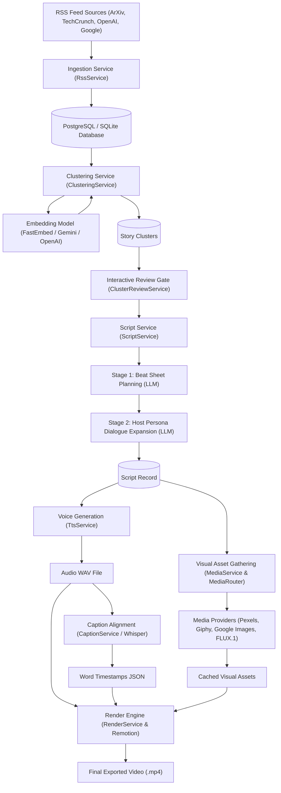
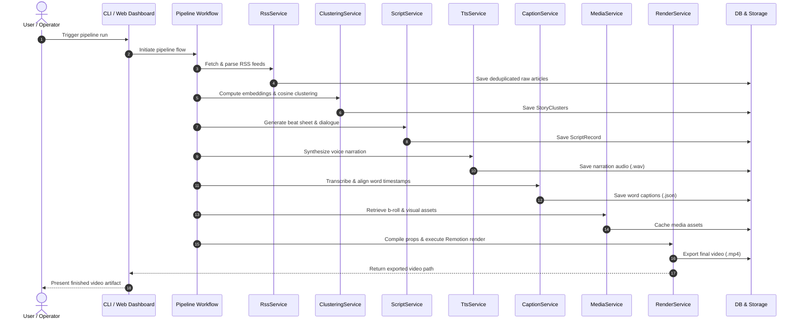

# System Explanation and Design

## Overview

The AI News to Video Pipeline automatically transforms trending AI research papers, industry announcements, and tech news into high-retention short-form videos (9:16 vertical shorts or 16:9 widescreen). The system ingests RSS feeds, normalizes articles, computes semantic vector embeddings, clusters related news stories, plans structured narrative beat sheets, synthesizes conversational host narration, retrieves context-aligned visual assets (b-roll videos, GIFs, entity photos, SVG brand cards), and renders final motion graphics via Remotion.

## System Flow

### Component Flowchart



### Execution Sequence Diagram



### Ingestion

- **Feed Parsing**: Ingest a configured list of RSS feeds across major AI news sources (such as ArXiv, TechCrunch, OpenAI, Google, Anthropic), using dedicated parsers to convert each feed into a unified structured format.
- **Time Window Filtering**: Support a configurable time limit to extract articles published only within a specific timeframe.
- **Deduplication and Storage**: Deduplicate records by URL link and persist articles in PostgreSQL via the article database repository.
- **Database Schema**:
  - `title`: Article title
  - `info`: Summary or content details
  - `author`: Article author (if available from RSS)
  - `article_created_at`: Publication timestamp reported by the RSS feed
  - `ingested_at`: Ingestion timestamp
  - `embedding`: Vector representation (generated during clustering)
  - `embedding_created_at`: Timestamp when the embedding was generated
  - `id`: Auto-incrementing primary key (article index ID)

## Clustering

- **Embedding Generation**: Ingested articles (`title` and summary) are passed to an embedding model (FastEmbed local ONNX, Google AI Studio, or OpenAI/LiteLLM) to generate dense vector representations.
- **Pairwise Cosine Similarity**: Normalizes vectors and calculates an all-pairs cosine similarity matrix (`S = V . V^T`) to evaluate semantic relationships among ingested articles.
- **Connected Component Clustering**: Iterates through the similarity matrix with a configurable threshold (`similarity_threshold: 0.82`) to group related articles covering the same news topic into cohesive story clusters.
- **Downstream Cluster Handoff**: Each identified cluster is assigned a unique `cluster_id` and an ordered list of member article IDs. The `cluster_id` is passed downstream to subsequent stages (such as script generation and roundups).
- **Database Schema and Tracking (Story Cluster)**:
  - `id`: Cluster index identifier (primary key passed downstream)
  - `cluster_hash`: Deterministic SHA-256 hash of sorted member article IDs
  - `title`: Primary headline representing the story
  - `summary`: Combined multi-source summary of member articles
  - `article_ids`: JSON array linking member article index IDs
  - `article_count`: Total number of clustered articles
  - `status`: Lifecycle tracking (`pending`, `scripted`)
  - `created_at`: Timestamp when the cluster was created
- **Planned Capabilities**:
  - Cross-cluster similarity analysis to identify thematic overlaps and feature similarities between distinct clusters over time.

## Script Creation

- **Overview**: Driven by configurable YAML prompt templates, this stage uses LLM prompt instructions to plan both the visual framing (b-roll directions and lower-third text) and the narration text for the video.
- **Two-Stage Architecture**:
  - **Stage 1: Narrative Beat Sheet Planning**: Takes the `cluster_id` and article data to construct a 5-beat story outline using a structured narrative framework: *Hook*, *Context*, *Technical Breakdown*, *Skepticism/Reaction*, and *Outro*. Editorial focus or story framing can be customized via the Stage 1 prompt configuration.
  - **Stage 2: Host Dialogue and Narration Writing**: Expands the beat sheet into polished, conversational host dialogue formatted specifically for TTS audio generation. Host persona, tone, and commentary style are configured via the Stage 2 persona configuration.
- **Database Persistence (Script Record)**:
  - `id`: Unique script record identifier
  - `cluster_id`: Foreign key linking to the source story cluster
  - `title`: Video title
  - `aspect_ratio`: Target video format (`9:16` vertical or `16:9` widescreen)
  - `beats`: JSON array storing beat data (visual directions, lower-third text, target duration)
  - `full_narration`: Cleaned narration text for TTS execution
  - `created_at`: Creation timestamp
- **Multi-Story Roundup Support**:
  - Supports generating consolidated scripts across multiple clusters (`cluster_ids`), with ongoing feature integration.
- **Planned Capabilities**:
  - Multi-cluster parallel processing and precise time/word-budgeted script generation.

## Voice Generation

- **Overview**: Receives the `script_id` and synthesized narration text from the script creation phase, phonetically sanitizes speech text via the voice synthesis service, and outputs a 24kHz mono `.wav` audio artifact.
- **Provider Architecture**:
  - **Primary Provider**: Google Gemini 2.0 Flash Audio (`gemini-2.0-flash` with prebuilt voices such as `Puck`).
  - **Secondary Fallback**: Edge TTS (`edge-tts` neural voices such as `en-US-ChristopherNeural`, standardized to 24kHz mono WAV via `ffmpeg`).
  - **Configurable Local Provider**: Local endpoint / binary TTS provider (`src/services/local_tts_provider.py` supporting Kokoro, Piper, or local HTTP audio servers).
  - **Fail-Fast Policy**: Silent synthetic placeholder generation has been removed. If synthesis fails across all configured providers, the service raises an explicit exception.
- **Caption Synchronization**:
  - Integrates with the speech-to-text caption service using Faster-Whisper to extract word-level timestamps (`start`, `end`, `confidence`) for kinetic subtitle rendering.
- **Planned Refinements and Roadmap**:
  - Add host voice cloning support using provided audio sample recordings of the host persona.

## Visual Artifact Gathering

- **Overview**: Driven by the visual media management service, this stage parses visual directions and keyword cues from each script beat to retrieve and cache visual assets.
- **Visual Provider Routing**: The media routing module directs queries across multiple specialized providers:
  - **Pexels**: HD stock videos for general tech and data center imagery.
  - **Giphy**: Animated reaction GIFs for comedic beats.
  - **Google Images & Wikimedia**: Entity photos via the image search service for specific tech figures and companies.
  - **AI Image Generation**: Custom visuals via the AI image generation service (FLUX.1 / Imagen 3).
  - **Brand Cards**: SVG tech company cards generated via the brand card service.
- **Quality Inspection Modes**:
  - **Automated**: Deduplication and keyword matching.
  - **Multimodal VLM**: The visual quality inspector evaluates visual relevance against narration using Gemini VLM.
  - **Human-in-the-Loop (HIL)**: Interactive review and asset replacement interface.

## Video Rendering and Composition

- **Engine Architecture**: Uses Remotion (a React 18 programmatic video motion graphics framework in `remotion/`).
- **Composition Layering**: The rendering service compiles pipeline properties into JSON for `MainVideo.tsx`, which layers:
  - **Visual Media & Transitions**: Video clips, images, and brand cards.
  - **Procedural Background**: `AnimatedBackground.tsx` cyber grid reacting to beat emotions.
  - **Kinetic Typography**: `Captions.tsx` displaying word-level synchronized subtitles.
  - **Overlays**: `TitleCard.tsx` (lower-third headline), `Watermark.tsx` (channel badge), and `OutroCard.tsx` (call-to-action).
- **Output**: Executes `npx remotion render` to export final MP4 videos to `./output/videos/`.

## Configuration and Model Gateway Mapping

- **Unified Configuration**: Configured via `config.yaml` and validated at startup via central settings. Precedence order: CLI flags > Environment variables > `config.yaml` > `.env` > Defaults.
- **LiteLLM Gateway Mapping**: Optional proxy gateway configuration (`config/litellm_config.yaml`) routes abstract pipeline roles (`planning`, `writing`, `embedding`) across Google AI Studio (Gemini), OpenAI, DeepSeek, or local models. Supports direct BYOK provider connections.

## Pipeline Execution Interfaces

- **Command-Line Interface (CLI)**: Command-line interface built with Typer and Rich. Supports modular stage subcommands (`ingest`, `cluster`, `script`, `voice`, `media`, `render`, `roundup`) and automated end-to-end pipeline execution.
- **Web Dashboard & REST API**: Web control panel (`/dashboard`) and REST API built with FastAPI. Provides pipeline controls, API endpoints (`/api/pipeline/*`), and interactive story/media review gates.

## Model Usage

### Pipeline Applications
- **Embedding Generation**: Text embeddings for article clustering and retrieval.
- **Beat Generation**: Script structuring and narrative pacing.
- **Video Artifact Generation**: Generating scene imagery and visual media.
- **Video Artifact Validation**: Quality checks and content verification on generated assets.
- **Subtitle Processing**: Subtitle alignment and redundancy filtering.
- **Audio Generation**: Generating voiceovers for the script.
- **Configurable Execution Modes**: Each stage supports configurable execution modes, allowing users to choose between cloud API calls and local model execution via configuration.

### Configuration and Provider Architecture
- **Unified API Gateway (LiteLLM)**: API-based models are routed through a unified LiteLLM configuration, supporting:
  - Google Gemini API (Google AI Studio)
  - OpenAI API models
- **Flexible Execution Modes**: Each layer supports both cloud API calls and local model execution via configuration.
- **Local Fallbacks**: Local models (such as downloaded sentence transformer embeddings) serve as configurable fallbacks if cloud APIs become unavailable.

## Project Folder Structure

```text
silver-tribble/
├── config/                          # Optional LiteLLM proxy gateway configuration
│   └── litellm_config.yaml          # LiteLLM model routing and fallback definitions
├── config.yaml                      # Active pipeline configuration (models, keys, paths)
├── config_example.yaml              # Template configuration reference
├── data/                            # Persistent data storage
│   ├── ai_news.db                   # Local SQLite database
│   └── assets/                      # Generated media assets (audio, captions, render props)
├── artifacts/                       # Cached downloads and temporary pipeline artifacts
│   └── media/                       # Downloaded videos, GIFs, and generated image cards
├── output/                          # Rendered production output
│   └── videos/                      # Final exported MP4 video files
├── prompts/                         # Declarative YAML prompt and persona templates
│   ├── beat_sheet.yaml              # Stage 1 narrative beat sheet planning prompt
│   ├── eswar_host_persona.yaml      # Stage 2 host commentary and dialogue expansion prompt
│   ├── media_inspector.yaml         # Multimodal VLM visual inspection rubric
│   ├── media_routing_rules.yaml     # Keyword-to-provider visual routing rules
│   └── roundup_script.yaml          # Multi-story news roundup script template
├── remotion/                        # Remotion React-based motion graphics and video engine
│   ├── remotion.config.ts           # Remotion CLI configuration (OpenGL, image format)
│   ├── package.json                 # Node.js dependencies (Remotion, React 18)
│   ├── public/                      # Static assets and media symlink
│   │   ├── media/                   # Symlink pointing to artifacts/media
│   │   └── music/                   # Background audio tracks
│   └── src/
│       ├── Root.tsx                 # Composition registry (Vertical and Horizontal)
│       ├── index.ts                 # Remotion root registration entrypoint
│       ├── types.ts                 # TypeScript interfaces mirroring Python Pydantic schemas
│       ├── compositions/
│       │   └── MainVideo.tsx        # Master composition layering visuals, captions, and audio
│       └── components/
│           ├── AnimatedBackground.tsx # Procedural emotion-reactive cyber grid
│           ├── Captions.tsx         # Word-level synchronized kinetic typography
│           ├── TitleCard.tsx        # Lower-third headline and topic card
│           ├── Watermark.tsx        # Branding badge and watermark overlay
│           └── OutroCard.tsx        # Subscription call-to-action closing card
├── scripts/                         # Standalone execution scripts for individual stages
│   ├── run_ingest.py                # RSS ingestion stage runner
│   ├── run_cluster.py               # Story clustering stage runner
│   ├── run_script.py                # Script and beat generation runner
│   ├── run_voice.py                 # Audio synthesis and caption alignment runner
│   ├── run_media.py                 # Media routing and asset gathering runner
│   ├── run_render.py                # Remotion video render runner
│   ├── run_roundup.py               # Multi-story roundup script runner
│   └── run_edit_media.py            # Manual asset replacement utility
├── src/                             # Core Python application source code
│   ├── cli.py                       # Typer CLI interface with subcommands
│   ├── web.py                       # FastAPI web dashboard and REST API routes
│   ├── core/                        # Application infrastructure
│   │   ├── config.py                # Pydantic settings loading and validation
│   │   └── database.py              # SQLAlchemy engine and session factory
│   ├── flows/                       # Orchestrated pipeline workflows
│   │   └── video_pipeline_flow.py   # End-to-end multi-stage pipeline flow
│   ├── models/                      # Data models and contracts
│   │   ├── entities.py              # SQLAlchemy ORM entity definitions
│   │   └── schemas.py               # Pydantic data validation schemas
│   ├── repositories/                # Data access layer (Repositories)
│   │   ├── base.py                  # Base repository generic operations
│   │   ├── article_repository.py    # Article and story cluster CRUD
│   │   ├── script_repository.py     # Script record and beat persistence
│   │   ├── render_repository.py     # Render job status and output tracking
│   │   ├── asset_repository.py      # Visual asset library indexing and retrieval
│   │   ├── cost_repository.py       # Multi-stage cost and token spend logging
│   │   └── action_log_repository.py # Pipeline event and audit trail logging
│   ├── services/                    # Business logic layer (Services)
│   │   ├── rss_service.py           # Feed scraping, HTML cleaning, and deduplication
│   │   ├── clustering_service.py    # Embeddings generation and cosine clustering
│   │   ├── script_service.py        # Two-stage beat sheet and dialogue expansion
│   │   ├── script_auditor_service.py # Pacing and hook quality retention auditing
│   │   ├── cluster_review_service.py # Interactive cluster selection gate
│   │   ├── tts_service.py           # Voice synthesis (Gemini, Edge TTS, local)
│   │   ├── local_tts_provider.py    # Local endpoint and binary TTS adapter (Kokoro, Piper)
│   │   ├── caption_service.py       # Whisper speech-to-text word alignment
│   │   ├── subtitle_service.py      # SRT and WebVTT subtitle formatting
│   │   ├── media_service.py         # Visual asset placement and cache manager
│   │   ├── media_router.py          # Context-driven visual source router
│   │   ├── media_inspector.py       # Multimodal VLM visual quality validation
│   │   ├── image_search_service.py  # Google Images and Wikimedia entity search
│   │   ├── image_generation_service.py # FLUX.1 and Imagen 3 AI image generation
│   │   ├── brand_card_service.py    # Tech company logo and card generator
│   │   ├── storage_service.py       # Local and S3/R2 storage adapter
│   │   ├── render_service.py        # Remotion rendering bridge and props compiler
│   │   ├── youtube_metadata_service.py # SEO title, description, and tag generation
│   │   ├── cache_pruning_service.py # Cache cleanup and disk quota maintenance
│   │   ├── health_service.py        # Pipeline diagnostic health checker
│   │   └── webhook_service.py       # External job completion webhooks
│   └── templates/                   # Frontend web assets
│       └── dashboard.html           # Pipeline monitoring and script approval UI
├── tests/                           # Automated test suite (pytest)
│   ├── conftest.py                  # Shared test fixtures and mock databases
│   ├── test_e2e_pipeline.py         # End-to-end integration tests
│   ├── test_services.py             # Service unit tests
│   ├── test_media_router.py         # Visual routing logic tests
│   ├── test_render_props.py         # Remotion props compiler tests
│   └── test_web_api.py              # FastAPI endpoint tests
├── pyproject.toml                   # Project dependencies and tool configurations
├── uv.lock                          # Dependency lockfile
└── design.md                        # Architectural design documentation
```