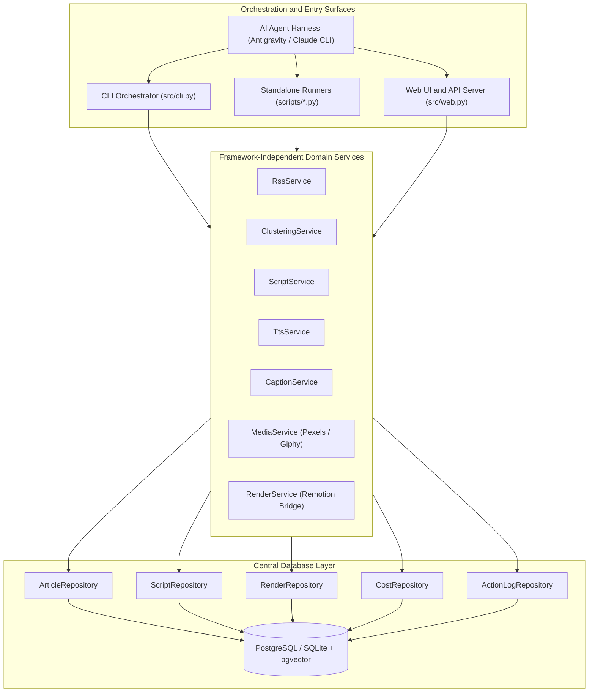

# Technical Specification: Modular AI Video Production Platform

**Document Version:** 1.0  
**Target Audience:** Software Engineers, Systems Architects  
**Author:** AI Engineering Pair  

---

## 1. Executive Summary

This specification outlines the refactoring and feature additions for the AI Video Pipeline repository. The goal is to transform the codebase into a modular, multi-surface platform where:

1. Every stage is accessible as an independent, standalone script (micro-monolith per service).
2. The unified CLI orchestration is preserved and augmented with machine-readable JSON flags.
3. An AI agent harness (Antigravity CLI or Claude CLI) can orchestrate, inspect, and self-heal the workflow.
4. A central database repository acts as the single source of truth and logs every action for observability across all interfaces.
5. Sentences are paired with stock assets (Pexels) and reaction memes (Giphy) stitched dynamically in Remotion.
6. Configurable watermarks and intro/outro delays control pacing and branding.
7. A lightweight FastAPI web server and modern Web UI allow visual monitoring, editing, and execution.

---

## 2. Architecture Overview



---

## 3. Database Schema and Action Audit Logging

All actions taken by the CLI, Web UI, Agent harness, or background workers must be recorded in the database.

### 3.1 New Database Entity: `ActionLog`

File: `src/models/entities.py`

```python
class ActionLog(Base):
    """Audit log recording every operational event across all interfaces."""

    __tablename__ = "action_logs"

    id: Mapped[int] = mapped_column(Integer, primary_key=True, autoincrement=True)
    stage: Mapped[str] = mapped_column(String(50), nullable=False, index=True)
    action: Mapped[str] = mapped_column(String(100), nullable=False)
    actor: Mapped[str] = mapped_column(String(50), nullable=False, default="cli")
    status: Mapped[str] = mapped_column(String(30), nullable=False)
    job_id: Mapped[int | None] = mapped_column(Integer, nullable=True, index=True)
    message: Mapped[str] = mapped_column(Text, nullable=False, default="")
    details: Mapped[dict[str, Any] | None] = mapped_column(JSON, nullable=True)
    duration_seconds: Mapped[float | None] = mapped_column(Float, nullable=True)
    created_at: Mapped[datetime] = mapped_column(DateTime, default=utc_now, nullable=False)
```

Allowed values:
- `stage`: `"ingest"`, `"cluster"`, `"script"`, `"voice"`, `"captions"`, `"media"`, `"render"`, `"pipeline"`
- `actor`: `"cli"`, `"web"`, `"agent"`, `"system"`
- `status`: `"started"`, `"success"`, `"failed"`

### 3.2 Action Log Repository: `ActionLogRepository`

File: `src/repositories/action_log_repository.py`

Required methods:
1. `record_action(stage: str, action: str, actor: str, status: str, message: str = "", details: dict | None = None, job_id: int | None = None, duration_seconds: float | None = None) -> ActionLog`
2. `get_recent_logs(limit: int = 100, stage: str | None = None, status: str | None = None) -> list[ActionLog]`
3. `track_operation(stage: str, action: str, actor: str, job_id: int | None = None, details: dict | None = None)`: Python context manager that logs `"started"`, times the operation, and records `"success"` or `"failed"` upon exit.

---

## 4. Sentence-Level Visual Media Pipeline (Pexels and Giphy)

### 4.1 Keyword Extraction and Media Search Service

File: `src/services/media_service.py`

#### Responsibilities
1. For each sentence aligned by `CaptionService`, generate 1 to 3 search keywords.
2. Decide media format based on beat tone:
   - Factual context / serious beats: Stock photo or b-roll video from Pexels API.
   - Punchline / comedic dialogue / exaggeration beats: Reaction GIF or meme from Giphy API.
3. Download assets to local storage directory (`artifacts/media/` or configured storage adapter).
4. Output a structured list of media placements with explicit timestamps.

#### Media Item Data Contract
```python
class SentenceMediaPlacement(BaseModel):
    sentence_index: int
    start_time: float
    end_time: float
    keywords: list[str]
    media_type: Literal["image", "video", "gif"]
    local_path: str
    source_url: str
    provider: Literal["pexels", "giphy", "fallback"]
```

### 4.2 Configuration Parameters

File: `src/core/config.py`

Add configuration keys:
- `PEXELS_API_KEY: str = ""`
- `GIPHY_API_KEY: str = ""`
- `MEDIA_CACHE_DIR: Path = Path("artifacts/media")`
- `DEFAULT_MEDIA_TYPE_RATIO: float = 0.5` (Ratio of stock clips to comedic GIFs)

---

## 5. Watermark and Timing Control

### 5.1 Configuration Options

File: `src/core/config.py`

- `WATERMARK_TEXT: str = ""` (e.g. "@AINewsDesk")
- `WATERMARK_IMAGE_PATH: str = ""` (Path to transparent PNG logo)
- `WATERMARK_POSITION: str = "top-right"` (Allowed: "top-right", "top-left", "bottom-right", "bottom-left")
- `WATERMARK_OPACITY: float = 0.8`
- `INTRO_DELAY_SECONDS: float = 1.5` (Splash/watermark display before speech begins)
- `OUTRO_DURATION_SECONDS: float = 3.0` (Ending card display after speech ends)

### 5.2 Timestamp and Offset Alignment

File: `src/services/render_service.py`

1. If `intro_delay_seconds > 0`:
   - Shift the audio track playback offset in Remotion by `intro_delay_seconds`.
   - Shift every word caption `start` and `end` timestamp by `intro_delay_seconds`.
   - Shift sentence media placement timestamps by `intro_delay_seconds`.
2. Total video duration becomes:
   `total_duration = intro_delay_seconds + audio_duration + outro_duration_seconds`

### 5.3 Remotion Components

Files:
- `remotion/src/types.ts`: Add `SentenceMediaItem` and `WatermarkConfig` to `RenderProps`.
- `remotion/src/components/Watermark.tsx`: Overlay component rendering watermark with fade-in and configured positioning.
- `remotion/src/compositions/MainVideo.tsx`: Render active sentence media behind kinetic text and above procedural backgrounds.

---

## 6. Standalone Runner Scripts (`scripts/`)

Each service will have a dedicated, single-file entry point that can be executed independently from bash or subagents.

### 6.1 Common CLI Contract
Every script must support:
- `--json`: Output machine-readable JSON to standard output.
- `--actor`: Label the caller in `action_logs` (`"cli"`, `"agent"`, `"web"`).
- Non-zero exit code on unhandled failure with JSON error payload on standard error.

### 6.2 Script Inventory

1. `scripts/run_ingest.py`:
   - Executes RSS feed fetching.
   - Saves new articles to `ArticleRepository`.
   - Output JSON: `{"status": "success", "articles_fetched": 45, "new_articles_saved": 12}`

2. `scripts/run_cluster.py`:
   - Computes embeddings and forms story clusters.
   - Output JSON: `{"status": "success", "clusters_created": 3, "top_cluster_id": 14}`

3. `scripts/run_script.py`:
   - Input: `--cluster-id <id>` or `--auto-top`.
   - Generates beat sheet and narration dialogue.
   - Output JSON: `{"status": "success", "script_id": 8, "title": "...", "word_count": 140}`

4. `scripts/run_voice.py`:
   - Input: `--script-id <id>`.
   - Runs TTS synthesis and Whisper caption alignment.
   - Output JSON: `{"status": "success", "job_id": 4, "audio_path": "...", "duration": 34.2}`

5. `scripts/run_media.py`:
   - Input: `--job-id <id>`.
   - Extracts keywords per sentence, queries Pexels/Giphy, downloads assets.
   - Output JSON: `{"status": "success", "job_id": 4, "media_count": 8, "media_items": [...]}`

6. `scripts/run_render.py`:
   - Input: `--job-id <id>` and optional `--dry-run`.
   - Prepares Remotion props (watermark, intro delay, sentence media) and executes render.
   - Output JSON: `{"status": "success", "job_id": 4, "output_video_path": "..."}`

---

## 7. Web Server and Web UI (`src/web.py`)

A single-file FastAPI server providing both REST APIs and a self-contained dashboard.

### 7.1 REST API Routes

- `POST /api/pipeline/ingest`: Trigger RSS ingestion.
- `POST /api/pipeline/cluster`: Trigger embedding and clustering.
- `POST /api/pipeline/script`: Generate script for given cluster.
- `POST /api/pipeline/voice`: Generate voice and captions.
- `POST /api/pipeline/media`: Fetch Pexels/Giphy media assets.
- `POST /api/pipeline/render`: Execute Remotion render.
- `POST /api/pipeline/run`: Run end-to-end flow.
- `GET /api/logs`: Query `action_logs` with filtering (`stage`, `status`, `limit`).
- `GET /api/clusters`: List story clusters.
- `GET /api/scripts/{id}`: View or edit script record.
- `PUT /api/scripts/{id}`: Update script narration and beats before rendering.
- `GET /api/jobs`: List render jobs with video paths and duration.
- `GET /api/settings`: Read current pipeline settings.
- `POST /api/settings`: Update watermark and timing configuration.

### 7.2 Modern Web UI Views (Served at `/`)

Built with HTML5, Tailwind CSS, and Vanilla JavaScript without external node build dependencies:
1. **Pipeline Operations Center**: Step buttons with real-time status badges and one-click "Run All".
2. **Audit Action Log**: Live table auto-polling `/api/logs` with search and stage filters.
3. **Script Editor & Approver**: Side-by-side beat sheet and narration editor with word count and estimated duration.
4. **Media & Video Gallery**: Card gallery showing downloaded Pexels/Giphy assets and embedded HTML5 video player for finished MP4s.
5. **Branding & Watermark Panel**: Live interactive preview of watermark positioning, intro delay, and outro duration.

---

## 8. AI Agent Harness Orchestration Protocol

When Antigravity CLI (`agy`) or Claude CLI acts as the orchestrator, it follows an autonomous feedback loop:

```
Step 1: Execute Service via Script
        python scripts/run_script.py --cluster-id 12 --json
               │
               ▼
Step 2: Inspect Machine-Readable Output and DB
        Read JSON response and query ActionLogRepository
               │
               ▼
Step 3: Quality Gate and Critique
        Evaluate beat humor, pacing, and keyword relevance
               │
       ┌───────┴───────┐
       ▼               ▼
   [PASS]           [NEEDS REFINEMENT]
       │               │
       ▼               ▼
Step 4: Proceed    Adjust Prompt / Rerun Script
to Voice Stage     with critique adjustments
```

---

## 9. Implementation Roadmap

| Phase | Description | Key Deliverables |
|---|---|---|
| Phase 1 | Database & Audit Logging | `ActionLog` entity, `ActionLogRepository`, migration/init script, `ai-video logs` CLI command. |
| Phase 2 | Visual Media & Watermark | `MediaService` (Pexels/Giphy), config updates, Remotion `SentenceMediaItem` and `Watermark.tsx`. |
| Phase 3 | Standalone Runner Scripts | `scripts/run_*.py` suite with `--json` envelopes, CLI flag alignments. |
| Phase 4 | Web Server & Dashboard | `src/web.py` with FastAPI endpoints and embedded responsive Web UI. |
| Phase 5 | Verification & Tests | Automated pytest suite for logging, media fallback, timing offsets, and API endpoints. |

---

## 10. Non-Functional Requirements

- **Zero Breaking Changes**: Existing `ai-video` CLI commands must remain fully functional.
- **Fail-Fast**: Missing API keys for Pexels or Giphy must gracefully fall back to Remotion procedural animated backgrounds without crashing renders.
- **Strict Formatting Compliance**: No emojis and no em dashes in generated code, docstrings, or logs.
- **Type Safety**: Type hints across all public methods, Pydantic schemas, and repositories.
